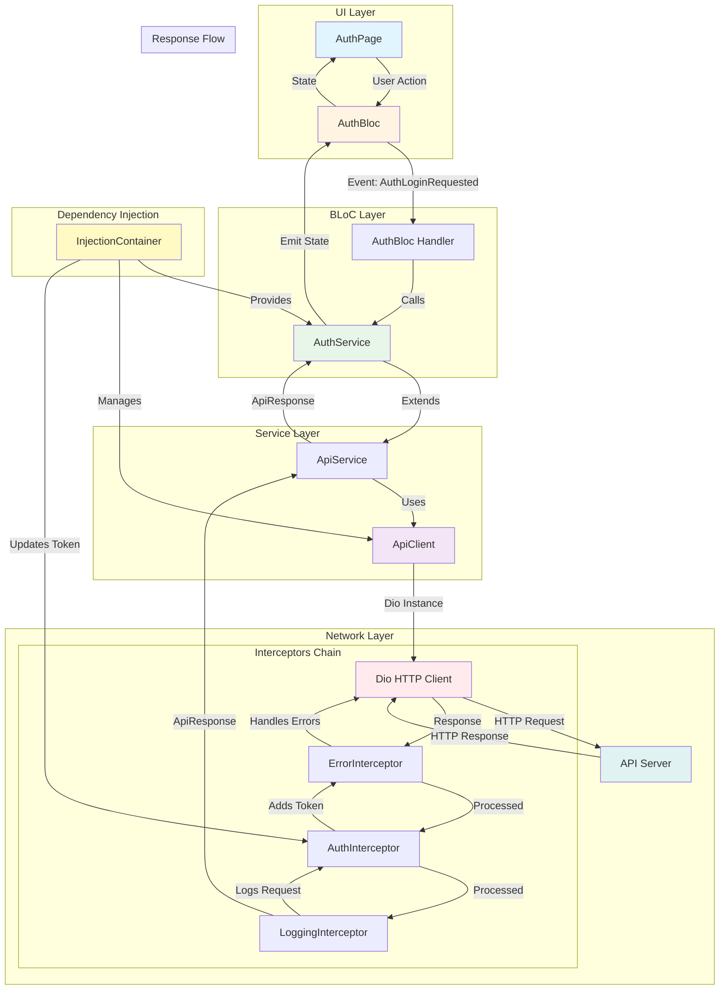
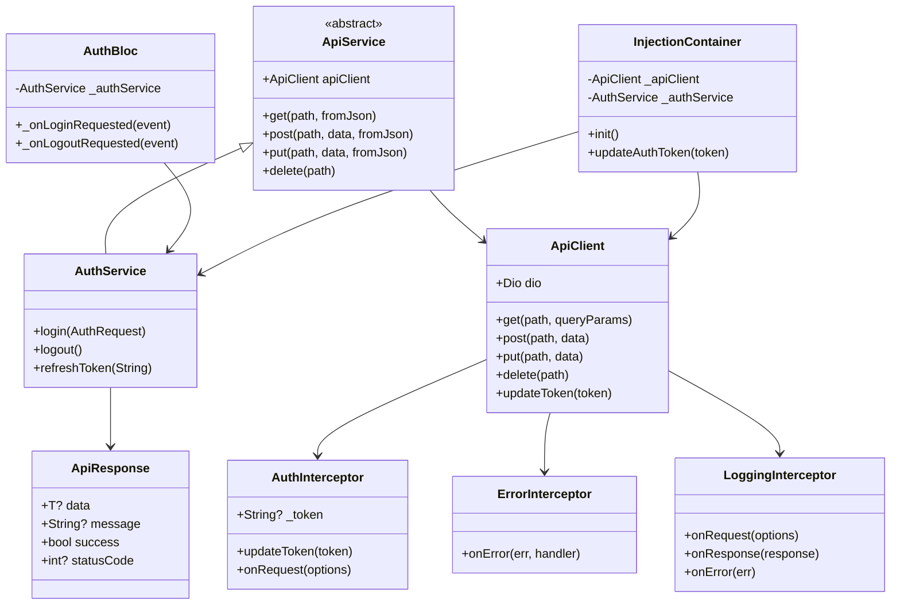
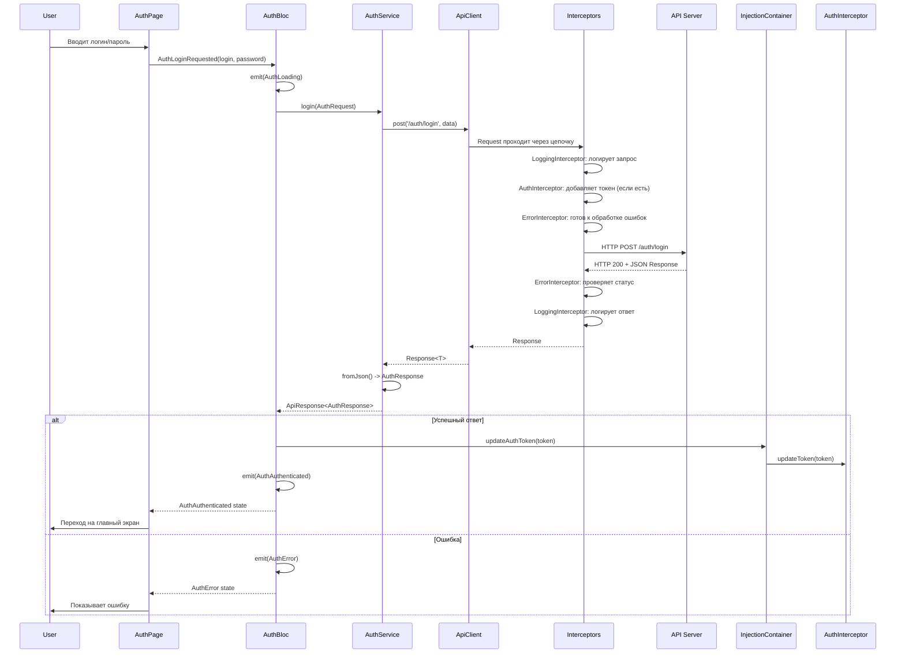

# Архитектура сетевого слоя API

## Схема работы с API



## Детальная схема компонентов



## Поток данных при авторизации



## Структура файлов

```
lib/
├── core/
│   ├── network/
│   │   ├── api_client.dart          # HTTP клиент на Dio
│   │   ├── api_service.dart          # Базовый класс для сервисов
│   │   ├── api_response.dart         # Обертка для ответов
│   │   ├── api_exception.dart        # Класс исключений
│   │   ├── network.dart              # Экспорты
│   │   └── interceptors/
│   │       ├── auth_interceptor.dart      # Добавление токена
│   │       ├── error_interceptor.dart     # Обработка ошибок
│   │       └── logging_interceptor.dart   # Логирование
│   ├── config/
│   │   └── api_config.dart           # Конфигурация API
│   └── di/
│       └── injection_container.dart  # DI контейнер
│
└── features/
    └── auth/
        ├── bloc/
        │   └── auth_bloc.dart        # Использует AuthService
        ├── services/
        │   └── auth_service.dart     # Наследует ApiService
        └── models/
            ├── auth_request.dart     # Модель запроса
            └── auth_response.dart    # Модель ответа
```

## Ключевые принципы

1. **Разделение ответственности**: UI → BLoC → Service → Network
2. **Единая точка входа**: `ApiService` для всех сервисов
3. **Автоматическая обработка**: Интерцепторы обрабатывают токены и ошибки
4. **Типобезопасность**: `ApiResponse<T>` с поддержкой дженериков
5. **Dependency Injection**: Централизованное управление зависимостями
6. **Расширяемость**: Легко добавить новые сервисы, наследуясь от `ApiService`
